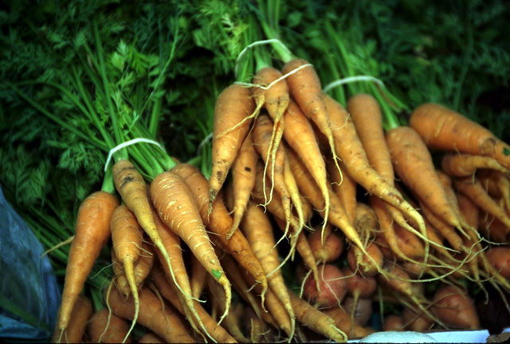
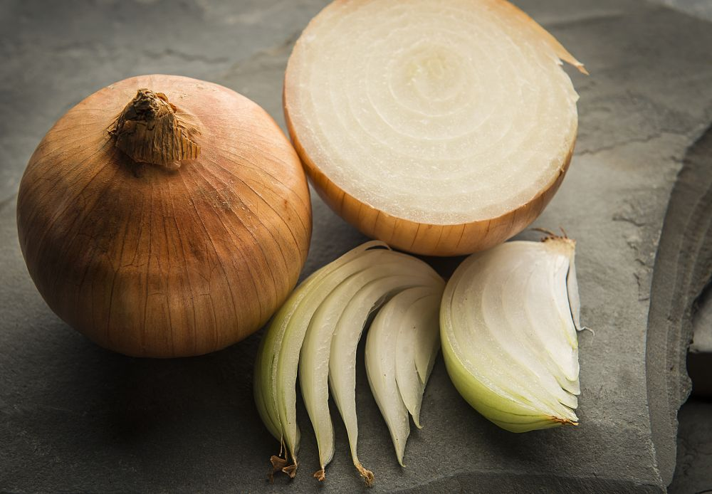

<html>
<body>
<h1>Conheça alguns vegetais que fazem bem à saúde</h1>
<h2>Você sabia que comer vegetais frescos faz bem à saúde?</h2>
<h3>Veja esta lista:</h3>
<h4>Batata, batata-inglesa, batatinha, pataca, escorva, papa, ou semilha é uma planta perene da família das solanáceas. A planta adulta geralmente tem entre sessenta a cem centímetros de altura, possui flores e frutos e produz um tubérculo comestível rico em amido, um carboidrato. <a href="https://pt.wikipedia.org/wiki/Batata">Clique aqui para saber mais sobre a batata</a></h4> 

<h4>Daucus carota subsp sativus popularmente conhecido como cenoura, é uma planta da família das apiáceas conhecida e apreciada desde a época dos antigos gregos e romanos. O nome também designa a raiz dessa planta, raiz esta que é tuberosa, laranja, com uma textura lenhosa e comestível. <a href="https://pt.wikipedia.org/wiki/Cenoura">Clique aqui para saber mais sobre a cenoura</a></h4> 

<h4>Cebola é o nome popular da planta cujo nome científico é Allium cepa. Em sistemas taxonómicos mais antigos, pertencia à família das Liliáceas e subfamília das alioídeas - taxonomistas mais recentes incluem-na na família das Amaryllidaceae. <a href="https://pt.wikipedia.org/wiki/Cebola">Clique aqui para saber mais sobre a cebola</a></h4>

</body>
</html>
